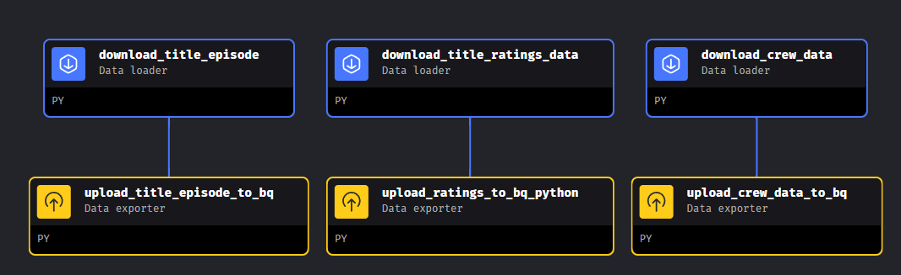
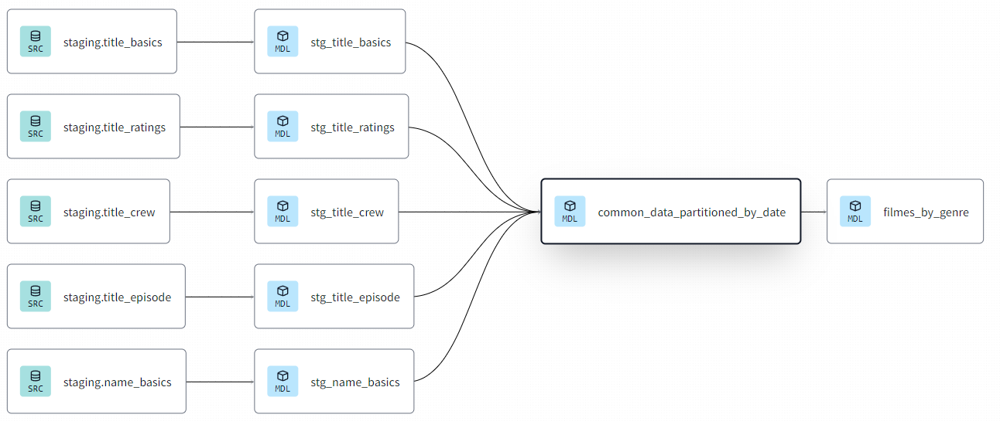
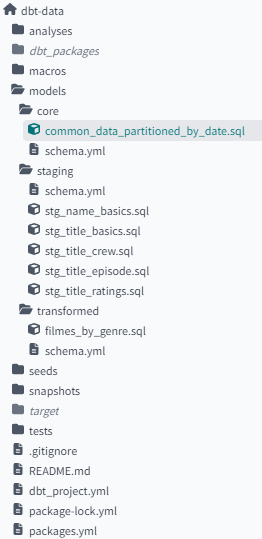
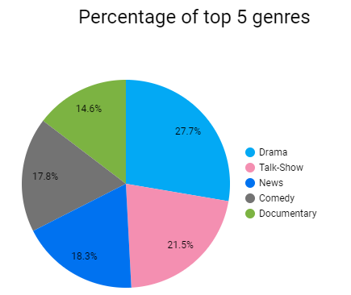
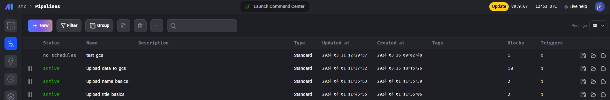
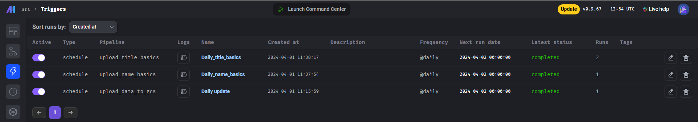
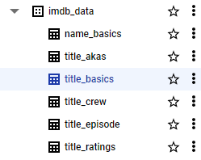
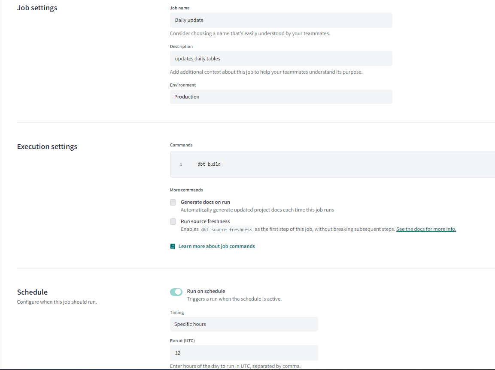
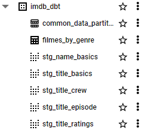

# IMDb Genre and Ratings Analysis Project

## Used Technologies

This project leverages a variety of tools and technologies:

* Docker: Utilized for creating and managing containers.
* Mage AI: Employed for downloading and uploading raw data to BigQuery, as well as for orchestration tasks.
* Terraform: Used as an Infrastructure-as-Code (IaC) tool to automate infrastructure management.
* Google Compute Engine: Serves as the cloud computing service for running virtual machines.
* Google Cloud Storage: Provides storage solutions for Terraform configuration files and other project data.
* Google BigQuery: Acts as the Data Warehouse for storing and analyzing project data.
* dbt: Utilized for transforming raw data stored in BigQuery.
* Google Looker Studio: Used for creating visualizations and dashboards.

The project automatically retrieves data daily from IMDb Developer, processes it using Mage AI, and stores it in BigQuery. Transformations on this raw data are performed with dbt before the processed data is visualized in Looker Studio.

## Problem description

The entertainment industry produces an immense volume of movies, TV programs, and shows annually. This project seeks to identify the most popular genres among these productions and analyze audience ratings. The analysis is based on a publicly available dataset provided by IMDb Developer. The project encompasses the following tasks:

* Scheduled data retrieval from the source to BigQuery.
* Transformation of data in dbt to generate a common dataset and a reporting table, which are then uploaded back to BigQuery.
* Utilization of Looker Studio for data visualization.


## Cloud

The project is deployed on a Google Cloud Virtual Machine and utilizes Terraform for infrastructure management.

## Data ingestion and Workflow orchestration

Data is sourced daily from IMDb Developer and uploaded to BigQuery using Mage AI's Python scripts. This setup ensures efficient data management and workflow orchestration.



## Data warehouse and Transformations (dbt)

dbt plays a crucial role in transforming the raw data stored in BigQuery, making it suitable for analysis and visualization. The transformations are performed daily to keep the dataset updated.





## Dashboard

Visualizations are crafted in [Looker Studio](https://lookerstudio.google.com/s/gZF7TQfkxcs), which helps in presenting the data analysis through interactive elements and insights.




# How to reproduce

Follow these steps to replicate the project:

## Setting up a virtual machine

It is recommended to use the comprehensive guide provided by [DeZoomcamp](https://www.youtube.com/watch?v=ae-CV2KfoN0&list=PL3MmuxUbc_hJed7dXYoJw8DoCuVHhGEQb&index=15), covering all necessary steps from generating SSH keys to setting up and connecting to a virtual machine on GCP.

## Uploading raw data to BigQuery

* Utilize VS Code to connect to your virtual machine.
* Employ Mage AI as the orchestration tool for uploading datasets to BigQuery daily.
* Follow the instructions to configure and use Mage AI effectively for data management:

1. Clone the repo to your machine
2. Navigate to mage-data and start command 
```
docker-compose build
docker-compose up
```
3. To config Mage AI add your .json API key from Google Cloud to mage-data/ folder
4. After that Mage AI is up and can be connected on localhost:6789.
5. Run pipelines manually to upload data immediately or create triggers to run on schedule





6. Loaded raw data created in BigQuery



## Transforming using dbt

1. Set up a dbt account and configure your project according to the provided [instructions](https://github.com/DataTalksClub/data-engineering-zoomcamp/blob/main/04-analytics-engineering/dbt_cloud_setup.md).
2. Integrate your dbt account with GitHub for seamless project management and version control.
3. Execute dbt builds to process and transform the data for analysis.
```
dbt deps
dbt build
```
4. Create dbt job to run daily.



4. The new dataset created in BigQuery with several views and materialized table. Common data is partitioned and clustered.



## Terraform Integration

Leverage Terraform for efficient data upload to Google Cloud Storage:

1. Modify the main.tf file to include the correct credentials.
2. Execute the commands below from within the project directory:
```
terraform init
terraform apply
```
3. Check created folder in Google Cloud Storage
This process initiates Terraform, configuring it with your project's specifics, and applies the changes, facilitating the upload of your data to Google Cloud Storage seamlessly.

## Dashboard

1. Initiate a new report in Looker Studio and link the BigQuery table as a data source.
2. Customize the visualization tiles according to the project requirements to effectively communicate the analysis results.
